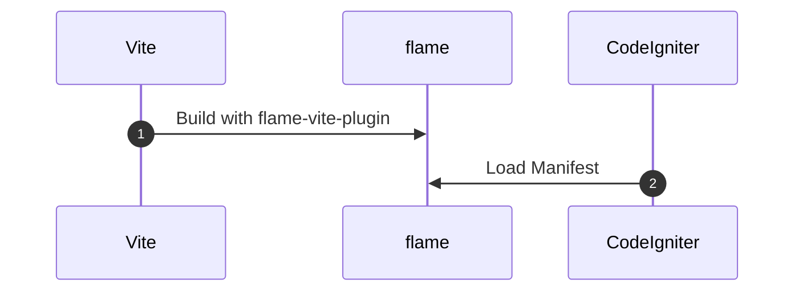

# flame

`flame` is the frontend integration library for [CodeIgniter4](https://github.com/codeigniter4/codeigniter4).

## Collaborate with vite frontend

This library loads manifest file which is generated via `vite` with [flame-vite-plugin](https://github.com/ysugimoto/flame-vite-plugin).
You can specify loading asset files like `<script>` and `<link>` by helper function.



For the generating manifest file, see [flame-vite-plugin](https://github.com/ysugimoto/flame-vite-plugin) documenration.

## Installation

You can install via [packagist](https://packagist.org/packages/ysugimoto/flame).

```shell
composer require --dev ysugimto/flame
```

And then run the CodeIgniter's command.

```shell
php spark flame:setup
```

The above command generated package configuration in your `app/Config/Flame.php`.
And also you need to load the `flame` helper. Modify configiration of your autoloader.

```php
# app/Config/Autoload.php

class Autoload extends AutoloadConfig
{
    ...
    public $helpers = ["flame"];
    ...
}
```

## Usage

> [!NOTE]
> You need to genearte manifest file before.

After the setup, you can use the `flame` helper function in your view files.

```php
<?php echo flame("[Asset Filename]");?>
```

We suggest to put this hepler calls inside the `<head>` tag or before the `</body>` tag.

### Preload

To improve script/css loading performance, you can configrure the [preload](https://developer.mozilla.org/en-US/docs/Web/HTML/Attributes/rel/preload).
To enable preloading, you can also use `flame_preload` helper function.

```php
<?php echo flame_preload("[Asset Filename]");?>
```

This function displays `<link rel="preload" ... />` tag so need to be called inside the `<head>` tag.

## Alias

On developing backend, you might not consider about what asset file sould be loaded on view file.
Then you can specify asset name as alias like:

```php
<?php echo flame("@main");?>
```

On the above case, the `@main` alias will be resolved in the manifest file so you don't take care of the asset filename.
To use the alias loading, see [Alias](https://github.com/ysugimoto/flame-vite-plugin?tab=readme-ov-file#alias) section in the vite plugin.


### DevServer / HMR

`vite` can runs dev server with HMR and the `flame` also can synchronize with it.
For example, `vite` command will start dev server like `http://localhost:5173`, and also `flame-vite-plugin` generates manifest file as **dev mode**.
The `flame` helper function automatically recognize the manifest is dev mode or not, and generates `<script>` tags with HMR mode.
It is useful for developing frontend view with CodeIgniter. When you change the frontend file, the view that is displayed by CodeIgniter will reload automatically.

## Contribution

- Fork this repository
- Customize / Fix problem
- Send PR :-)
- Or feel free to create issues for us. We'll look into it

## Author

Yoshiaki Sugimoto <sugimoto@wnotes.net>

## License

MIT
